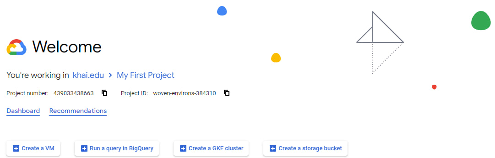
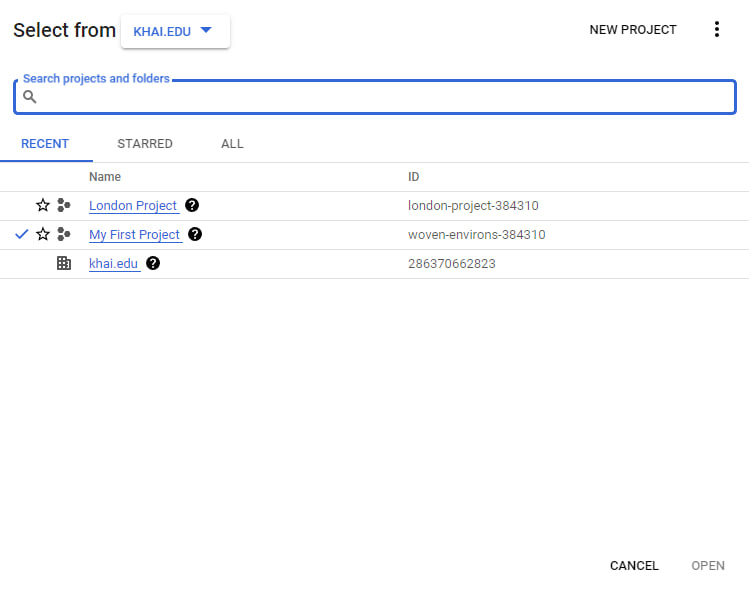
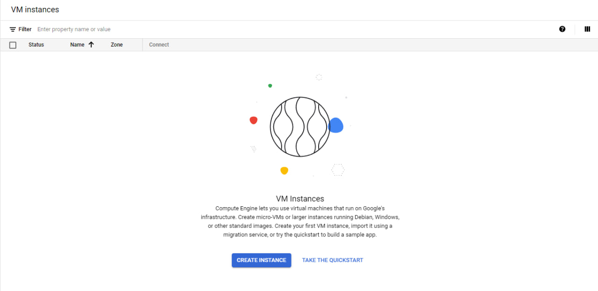
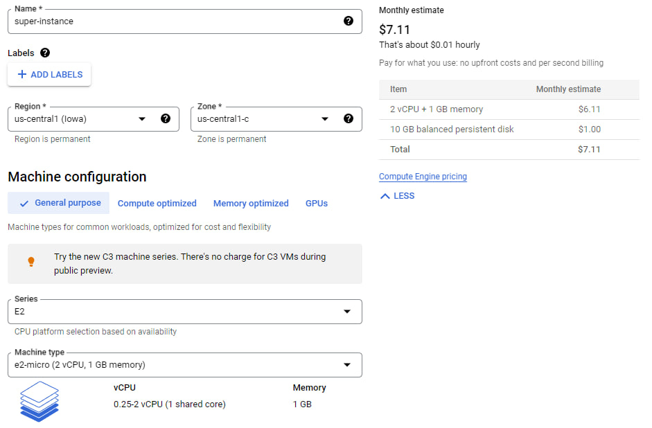
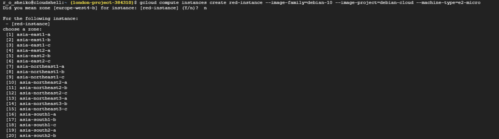
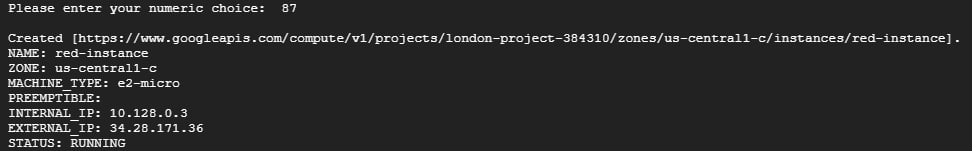
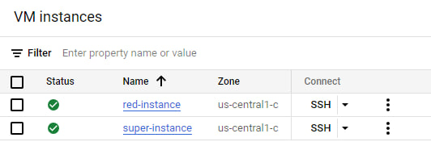

 

+ Створено акаунт Google Cloud Platform



+ Створили новий проект під назвою "London Project" 

<p align="center">
  
</p>

+ Активували Compute Engine API та почали створювати віртуальну машину 



+ Обрали необхідні нам параметри та створили віртуальну машину з назвою "super-instance"



+ Також створимо таку ж віртуальну машину за допомогою Cloud Shell. Для цього відкриємо Cloud Shell та введемо наступну команду:

```
gcloud compute images list
```

У відповідь ми отримаємо всі образу ОС, але ми оберемо Debian 10 та запишемо наступну команду:

```
gcloud compute instances create red-instance --image-family=debian-10 --image-project=debian-cloud --machine-type=e2-micro
```
+ Далі потрібно ввести "n", а після того обрати необхідний регіон, який у нас під номером 87. Після введеня, побачимо наступні виводи консолей:







+ Тож, таким чином ми створили віртуальну машину за допомогою Cloud Shell, перевірити це можна на сторінці оновивши її

<p align="center">
  
</p>

+ На малюнку бачимо дві працюючі віртуальні машини. Перша була створена звичайним методом, а інша через Cloud Shell

+ Висновок

У лабораторній роботі було виконано створення віртуальної машини використовуючи звичний спосіб, просто роблячи його на сайті Google Cloud. Та було створено машину за допомогою Cloud Shell. У нас це вдалося, про що свідчить останній скріншот з лабораторної.

